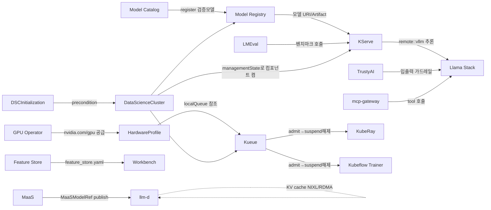

# RHOAI 3.4 컴포넌트 동작 이해 — 인덱스

> Red Hat OpenShift AI **3.4** self-managed 기준, 각 컴포넌트의 **아키텍처 · 구성요소 · CRD · 동작방식**을 업스트림 소스/CRD 정의까지 확인해 정리한 노트 모음.
> 조사 기준일 2026-06-17. 공식문서(docs.redhat.com 3.4) + 업스트림 GitHub CRD/소스 교차검증. **추정/미확인은 각 노트에 명시.**

---

## 이 폴더의 구조

- **`x0-<영역>-관계.md`** — 그 영역 컴포넌트들이 **서로 어떻게 엮이는지**(관계 ERD·데이터 흐름·경계).
- **`xy-<컴포넌트>.md`** — 컴포넌트 1개의 단독 심층 노트.
- 번호 규칙: 십의 자리 = 영역, 일의 자리 = 컴포넌트, `x0` = 영역 관계 파일.

---

## 영역 & 컴포넌트 맵

| 영역 | 관계 파일 | 컴포넌트 노트 |
|---|---|---|
| **플랫폼 토대** | [10-플랫폼토대-관계](10-플랫폼토대-관계.md) | [11-RHOAI-Operator](11-RHOAI-Operator.md) · [12-DataScienceCluster-DSCI](12-DataScienceCluster-DSCI.md) |
| **분산 워크로드(학습)** | [20-분산워크로드-관계](20-분산워크로드-관계.md) | [21-Kueue](21-Kueue.md) · [22-KubeRay-Ray](22-KubeRay-Ray.md) · [23-Kubeflow-Trainer-v2](23-Kubeflow-Trainer-v2.md) · [24-CodeFlare-SDK](24-CodeFlare-SDK.md) |
| **모델 서빙** | [30-모델서빙-관계](30-모델서빙-관계.md) | [31-KServe](31-KServe.md) · [32-llm-d-분산추론](32-llm-d-분산추론.md) · [33-MaaS](33-MaaS.md) |
| **파이프라인/실험** | [40-파이프라인실험-관계](40-파이프라인실험-관계.md) | [41-Data-Science-Pipelines](41-Data-Science-Pipelines.md) · [42-Workbenches](42-Workbenches.md) · [43-MLflow](43-MLflow.md) |
| **모델 거버넌스** | [50-모델거버넌스-관계](50-모델거버넌스-관계.md) | [51-Model-Registry](51-Model-Registry.md) · [52-Model-Catalog](52-Model-Catalog.md) · [53-Feature-Store-Feast](53-Feature-Store-Feast.md) |
| **GenAI/평가/안전** | [60-GenAI평가안전-관계](60-GenAI평가안전-관계.md) | [61-Llama-Stack](61-Llama-Stack.md) · [62-TrustyAI](62-TrustyAI.md) · [63-LMEval-Evaluation-Stack](63-LMEval-Evaluation-Stack.md) · [64-AI-Hub](64-AI-Hub.md) |
| **가속기/데이터/UI** | [70-가속기데이터UI-관계](70-가속기데이터UI-관계.md) | [71-GPU-하드웨어프로필](71-GPU-하드웨어프로필.md) · [72-IBM-Spyre](72-IBM-Spyre.md) · [73-Spark-Operator](73-Spark-Operator.md) · [74-ODH-Dashboard](74-ODH-Dashboard.md) |

---

## 마스터 — 컴포넌트 간 데이터교환 (Mermaid)

> 컴포넌트(박스) 간 **무슨 데이터가 어디로** 흐르는지. 영역별 정밀 CRD 관계는 각 `x0-*-관계` 노트의 erDiagram 참조.



---

## 전체를 꿰는 핵심 멘탈 모델

### 1. RHOAI = "오픈소스 조립품을 오퍼레이터로 묶은 것"
RHOAI는 단일 SW가 아니라, 다수의 독립 오픈소스(KServe·KubeRay·Kueue·Kubeflow·llm-d·vLLM·Feast·MLflow…)를 **하나의 메타 오퍼레이터**가 설치·관리하는 통합 플랫폼이다. 업스트림 커뮤니티는 **Open Data Hub(ODH)**, RHOAI는 그 상용 지원 배포판. → [11-RHOAI-Operator](11-RHOAI-Operator.md)

### 2. 모든 기능은 CRD로 선언된다 (2단계 reconcile)
```
DataScienceCluster CR (어떤 컴포넌트를 켤지)
   └─► 각 컴포넌트 CR (default-kserve, default-kueue …)
          └─► 컴포넌트 컨트롤러가 실제 Deployment/Service/CRD 배포
                 └─► 사용자 워크로드 CR (InferenceService, RayCluster, TrainJob …)
```
ML 라이프사이클의 각 단계가 **선언적 쿠버네티스 오브젝트(CR)**가 되며, 그래서 GitOps가 가능해진다.

### 3. 컨트롤 플레인 vs 데이터 플레인을 항상 분리해서 본다
- **컨트롤 플레인** = 클러스터에 **상주**하는 오퍼레이터/컨트롤러. 잡별로 안 뜬다. 계획·승인·생성을 담당.
- **데이터 플레인** = 잡/요청별로 **새로 뜨는** 워크로드 파드(학습/추론). 실제 연산만.
- 예: `RayCluster`라는 이름은 **데이터 플레인(파드 묶음)**의 이름이지, 컨트롤러가 아니다. 그걸 만드는 건 KubeRay 오퍼레이터(컨트롤 플레인). → [22-KubeRay-Ray](22-KubeRay-Ray.md)

### 4. 큐잉(Kueue)은 논리적 쿼터, 배치(kube-scheduler)는 물리 노드 — 2단계 판정
Kueue는 노드 상태를 보지 않고 **관리자가 설정한 nominalQuota 장부**로만 admit한다. 실제 노드 배치는 그다음 kube-scheduler. 이 갭이 **부분 스케줄링 데드락**의 씨앗. → [21-Kueue](21-Kueue.md), 운영 함정은 `../../../5-RHOAI-Delivery-Insights/01-발생-가능한-이슈`

---

## RHOAI 3.4 컴포넌트 버전 매트릭스 (요약)

> 출처: Red Hat "Supported Configurations 3.x" + 3.4 release notes (1차 fetch 기준, 마이너 버전은 GA 시점 변동 가능).

| 컴포넌트 | 업스트림 | 3.4 버전 | 라이프사이클 |
|---|---|---|---|
| RHOAI Operator | opendatahub-operator | (플랫폼 본체) | GA |
| Dashboard | odh-dashboard | 2.0.0 | GA |
| KServe | kserve/kserve | **0.17.0** | GA |
| Distributed Inference (llm-d) | llm-d/llm-d | **0.7.1** | **3.4 GA** |
| KubeRay | ray-project/kuberay | **1.4.2** | GA |
| Ray (런타임) | ray-project/ray | 2.53.0 | GA |
| Kubeflow Trainer v2 | kubeflow/trainer | **2.1.0** | **GA** |
| Kubeflow Training Operator v1 | kubeflow/training-operator | 1.9.0 | **Deprecated** |
| Kueue (Red Hat build) | kubernetes-sigs/kueue | 0.14~0.16대(추정) | GA |
| CodeFlare SDK | project-codeflare/codeflare-sdk | 0.34 | GA |
| Data Science Pipelines | KFP v2 + Argo | KFP 2.x / Argo 3.6~3.7 | GA |
| Workbenches | kubeflow notebooks | 1.10.0 | GA |
| Model Registry | kubeflow/model-registry | 0.3.x(추정) | GA |
| Feature Store | feast-dev/feast | 0.59~0.6x(추정) | **TP** |
| MLflow | mlflow/mlflow | 3.10.1 | **3.4 GA + DSC managed(신규)** |
| MaaS | models-as-a-service | 0.1.1 | **3.4 GA** |
| TrustyAI | trustyai-service-operator | 1.37.0 | GA |
| Llama Stack | llama-stack-k8s-operator | LS 0.6.0.1+rhai0 | TP(코어 GA, API 다수 TP/DP) |
| LMEval | lm-evaluation-harness | 0.4.8 | GA |
| IBM Spyre | vllm-project/vllm-spyre | — | **x86 TP** (Z/Power GA 추정) |
| Kubeflow Spark Operator | kubeflow/spark-operator | 2.x / Spark 4.0.1 | **DP** |

### 3.4의 주요 라이프사이클 변동
- **신규 GA**: MaaS, MLflow(+DSC managed 승격), HardwareProfiles, NeMo Guardrails, MLServer ServingRuntime, Direct OIDC.
- **Deprecated**: Training Operator v1, KServe Serverless 모드, Accelerator Profiles, FMS Guardrails(legacy).
- **Removed(3.x)**: CodeFlare Operator, Embedded Kueue, ModelMesh(v2 DSC에서 제외), AppWrapper/MCAD, TGIS/Caikit.

---

## 읽는 순서 추천

1. **토대부터**: [10-플랫폼토대-관계](10-플랫폼토대-관계.md) → [11-RHOAI-Operator](11-RHOAI-Operator.md) → [12-DataScienceCluster-DSCI](12-DataScienceCluster-DSCI.md)
2. **워크로드 흐름**: [20-분산워크로드-관계](20-분산워크로드-관계.md) (Kueue admission 메커니즘이 다른 영역에도 반복 적용됨)
3. **서빙**: [30-모델서빙-관계](30-모델서빙-관계.md) (KServe 단일 → llm-d 분산 → MaaS 거버넌스의 3층 누적)
4. 이후 관심 영역별로.

---

## 관련 노트 (이 폴더 밖)
- 기초 용어: `../../01-RHOAI-기초-용어정리`
- MLOps 종합 SSOT: `../../03-rhoai-mlops-knowledge`
- 플랫폼 아키텍처(KServe 배포모드/오토스케일 심화): `../../02-OpenShift-AI-플랫폼-아키텍처`
- GPU 공유 전략: `../../../5-RHOAI-Delivery-Insights/GPU-공유전략-MIG-MPS-Timeslicing`
- 운영 함정(부분 스케줄링 데드락 등): `../../../5-RHOAI-Delivery-Insights/01-발생-가능한-이슈`
