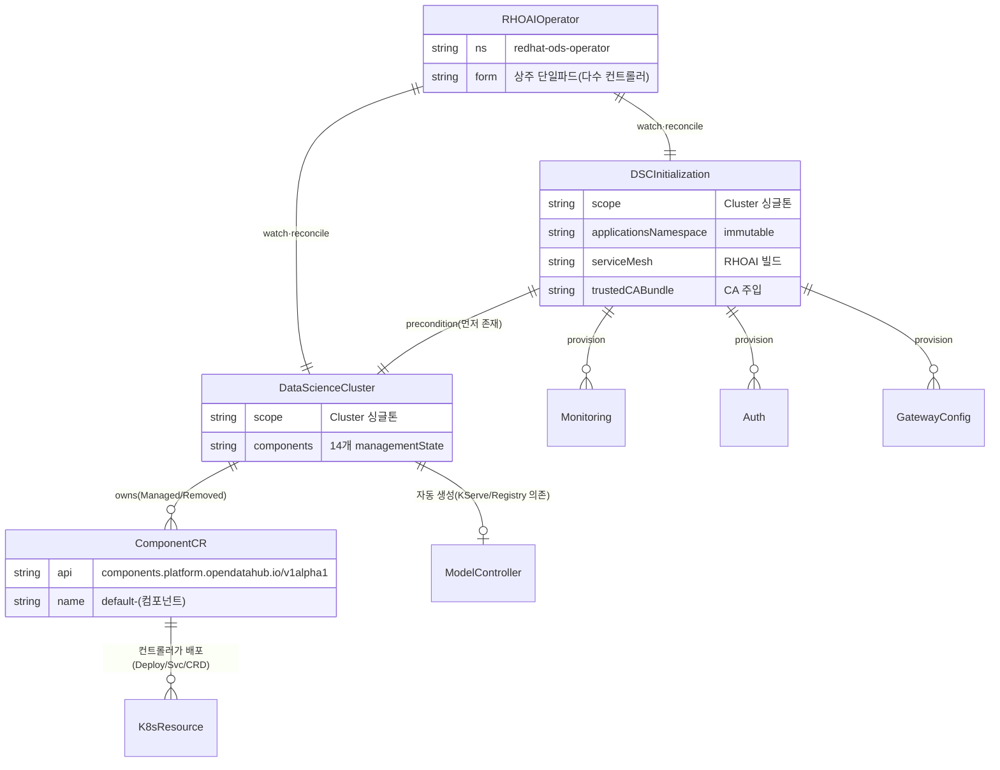

# 플랫폼 토대 — 영역 관계

> RHOAI를 설치·구성·수명관리하는 **메타 레이어**. 사용자는 단 2개의 클러스터 싱글톤 CR(**DSCI**, **DSC**)만 만들고, 나머지는 오퍼레이터가 전개한다.
> 컴포넌트: [11-RHOAI-Operator](11-RHOAI-Operator.md) · [12-DataScienceCluster-DSCI](12-DataScienceCluster-DSCI.md)

---

## 한 장 요약

```
OLM Subscription
   └─(설치)→ RHOAI Operator 파드  [redhat-ods-operator ns, 상주, 다수 컨트롤러 1프로세스]
                 watches: DSCI, DSC, GatewayConfig, 모든 컴포넌트 CR

① DSCInitialization (DSCI, 클러스터 싱글톤)   ← 플랫폼 공통 기반 먼저
     ├─ applicationsNamespace (redhat-ods-applications)
     ├─ Monitoring / Auth / (ServiceMesh) / trustedCABundle
        ▲ (precondition: DSC는 DSCI 존재를 요구)
② DataScienceCluster (DSC, 클러스터 싱글톤)   ← 그 위에 컴포넌트 토글
     └─(owns)→ 컴포넌트 CR 14종 (default-kserve, default-kueue, default-trainer …)
                  └─(reconciled by)→ 전용 컴포넌트 컨트롤러
                        └─(applies)→ 실제 Deployment/Service/CRD/RBAC
```

핵심: **2단계 reconcile**. DSC가 "어떤 컴포넌트를 켤지"를 컴포넌트 CR로 표현하면, 각 컴포넌트 컨트롤러가 그 CR을 받아 실제 워크로드를 배포한다.

---

## 두 컴포넌트의 역할 분담

| | DSCInitialization (DSCI) | DataScienceCluster (DSC) |
|---|---|---|
| 역할 | 플랫폼 **공통 기반** 초기화 | ML **컴포넌트** 토글 |
| 무엇 | 네임스페이스, 모니터링, Auth, ServiceMesh, CA 번들 | kserve/kueue/trainer/dashboard… `managementState` |
| 순서 | **먼저** | DSCI 이후 (precondition) |
| 개수 | 클러스터당 1 (싱글톤) | 클러스터당 1 (싱글톤) |
| api group | `dscinitialization.opendatahub.io` (v1/**v2**) | `datasciencecluster.opendatahub.io` (v1/**v2**) |

> 3.4는 두 CR 모두 **v1·v2 공존, v2가 storage version**. v2가 실질 동작 기준. (자세히는 [12-DataScienceCluster-DSCI](12-DataScienceCluster-DSCI.md))

---

## CRD 엔티티 ERD (Mermaid)



### 오가는 데이터

| 관계 | 주고받는 데이터/신호 |
|---|---|
| Operator → DSCI/DSC | reconcile 트리거(spec 변경 감시) |
| DSCI → DSC | applicationsNamespace·CA·ServiceMesh 등 공통기반 선구축 |
| DSC → ComponentCR | `managementState`(Managed/Removed) + 컴포넌트별 튜닝 spec |
| ComponentCR → K8sResource | 번들 매니페스트(Deployment/Service/CRD/RBAC) |
| ComponentCR → DSC.status | `releases[]`(실배포 업스트림 버전) 집계 |

## CRD 계층 ERD (ASCII)

```
DSCInitialization ──(provisions)──► 플랫폼 서비스 CR (services.platform.opendatahub.io/v1alpha1)
                                      ├─ Monitoring (default-monitoring)
                                      ├─ Auth (auth)
                                      └─ GatewayConfig
        ▲ precondition
DataScienceCluster ──(owns, owner-ref)──► 컴포넌트 CR (components.platform.opendatahub.io/v1alpha1)
   spec.components.<x>.managementState        각 "default-<name>", Cluster scope
     = Managed | Removed                      Dashboard, Workbenches, Kserve, (AI)Pipelines,
                                              Ray, Kueue, TrustyAI, ModelRegistry,
                                              TrainingOperator, Trainer, FeastOperator,
                                              LlamaStackOperator, MLflowOperator, SparkOperator
                                              + ModelController(자동, 토글불가)
                                              + Tenant(MaaS, 동적)
```

- **ModelController**: DSC `spec.components`에 노출 안 되는 **내부 컴포넌트**. KServe/ModelRegistry enable 여부에 따라 DSC가 자동 생성. 모델 서빙 공통 로직(NIM, WVA, 레지스트리 연동) 중재.
- **MaaS만 예외**: 다른 컴포넌트는 내장 매니페스트로 배포되지만, MaaS는 별도 maas-controller 번들을 설치하고 Tenant CR로 관리.

---

## 컴포넌트를 어떻게 배포하나 (RHOAI의 핵심 설계)

- **기본 = 내장(embedded) 매니페스트.** 오퍼레이터 이미지에 각 컴포넌트의 K8s 매니페스트가 번들됨. **컴포넌트별 별도 OLM Subscription을 만들지 않는다** — 오퍼레이터가 직접 컴포넌트 컨트롤러 Deployment까지 배포.
- 그래서 **사용자가 별도로 설치한 KubeRay/CodeFlare 오퍼레이터가 있으면 충돌** → 컴포넌트 enable 전 제거 필요.

---

## End-to-end 흐름

1. OLM이 RHOAI Operator 파드 설치 → 모든 컨트롤러 등록.
2. DSCI 생성(자동/수동) → 네임스페이스·모니터링·Auth·(ServiceMesh)·CA번들 등 **공통 기반** 구축.
3. DSC 생성 → reconcile 체인: `initialize → checkPreConditions(DSCI 확인) → updateStatus → provisionComponents → deploy → gc`.
4. enable된 컴포넌트마다 `default-<name>` CR 생성(owner-ref=DSC).
5. 각 컴포넌트 컨트롤러가 CR을 받아 **번들 매니페스트 apply** → 실제 워크로드 기동.
6. 컴포넌트 status가 DSC `status.components.<name>`로 집계, `ComponentsReady` 조건으로 전체 판정.
7. 컴포넌트를 `Removed`로 바꾸면 provision에서 빠지고 gc가 정리.

---

## 다른 영역과의 연동
- **DSCI → 전 영역**: applicationsNamespace(`redhat-ods-applications`)에 모든 컴포넌트가 배포됨. Monitoring이 전 컴포넌트 메트릭 공통 기반.
- **ServiceMesh/Gateway → 서빙**: KServe(특히 구 Serverless)·대시보드 진입이 ServiceMesh/GatewayConfig에 의존. (단 3.4 KServe RawDeployment 기본화로 ServiceMesh 의존 약화)
- **DSC `spec.components` → 모든 영역**: 이 폴더의 거의 모든 컴포넌트가 여기서 켜고 꺼진다.

---

## 출처
- 다운스트림 오퍼레이터 소스: https://github.com/red-hat-data-services/rhods-operator/tree/rhoai-3.4
- 업스트림: https://github.com/opendatahub-io/opendatahub-operator
- RHOAI 3.4 release notes / installing_and_uninstalling: docs.redhat.com 3.4
