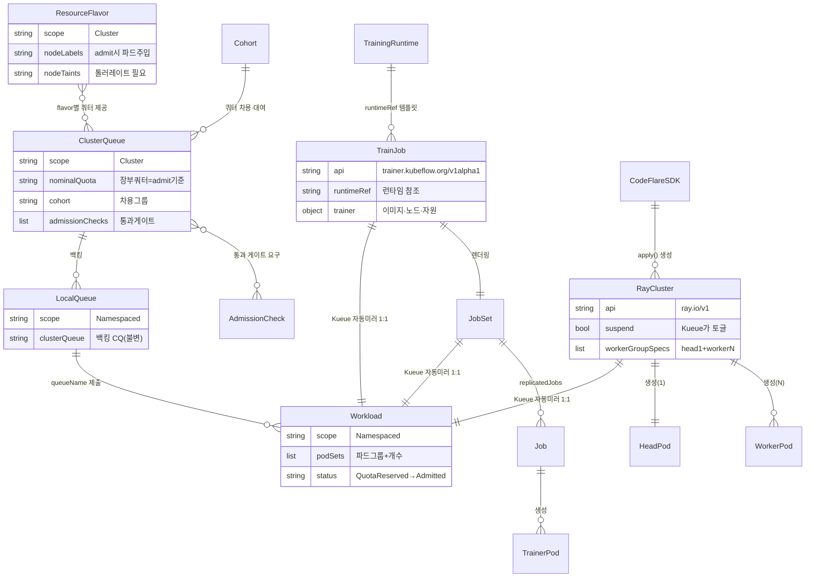

# 분산 워크로드 — 영역 관계

> 분산 학습/배치를 위한 **큐잉(Kueue) + 실행엔진(Ray / Kubeflow Trainer) + 클라이언트(CodeFlare SDK)** 스택. 역할이 계층으로 분리된다.
> 컴포넌트: [21-Kueue](21-Kueue.md) · [22-KubeRay-Ray](22-KubeRay-Ray.md) · [23-Kubeflow-Trainer-v2](23-Kubeflow-Trainer-v2.md) · [24-CodeFlare-SDK](24-CodeFlare-SDK.md)

---

## 핵심 멘탈 모델: 계층이 다르다

```
   ┌─────────────────────────────────────────────┐
   │  노트북 + CodeFlare SDK (Python 클라이언트)    │  ← 입구
   └───────────────┬─────────────────────────────┘
                   │ 워크로드 제출
       ┌───────────┴────────────┐
       ▼                        ▼
┌──────────────┐        ┌──────────────────┐
│ Ray (KubeRay) │        │ Kubeflow Trainer │   ← 실행 엔진 (2가지 경로)
│ RayCluster/Job│        │ TrainJob         │      "무엇을·얼마나" 정의 + 파드 생성
└──────┬───────┘        └────────┬─────────┘
       └──────────┬──────────────┘
                  ▼
          ┌───────────────┐
          │     Kueue     │   ← 큐잉/쿼터/갱 스케줄링 (admit 판정만, 파드 안 띄움)
          └───────┬───────┘
                  ▼
        kube-scheduler → kubelet (실제 노드 배치·기동)
```

핵심: **Ray든 Trainer든, 실제 파드가 뜨려면 반드시 Kueue admit을 거친다.** Kueue가 가장 아래의 공통 게이트.

---

## 컴포넌트 역할 분담

| 컴포넌트 | 계층 | 역할 | 파드를 만드나? |
|---|---|---|---|
| **CodeFlare SDK** | 클라이언트 | 노트북에서 RayCluster 정의·제출 | ✗ (CR만 생성) |
| **Kueue** | 큐잉/관제 | 쿼터·갱 스케줄링·admission | ✗ (suspend 토글만) |
| **KubeRay** | 실행 엔진 | RayCluster head+worker 파드 생성·관리 | ✅ (잡별) |
| **Kubeflow Trainer** | 실행 엔진 | TrainJob→JobSet→학습 파드 생성 | ✅ (잡별) |

---

## 컨트롤 플레인 vs 데이터 플레인 (★중요)

승인요청·계획은 **상주 공유 컨트롤러**가, 학습 실행은 **잡별 파드**가 한다. **승인은 학습 파드가 태어나기 전에 끝나므로** 한 파드가 두 역할을 겸할 수 없다.

| 역할 | 주체 | 파드 | 수명 |
|---|---|---|---|
| 승인·큐잉·쿼터 | **Kueue 컨트롤러** | 상주·전체 공유 | 항상 |
| 파드 생성 | **KubeRay / Trainer 오퍼레이터** | 상주·전체 공유 | 항상 |
| 학습 실행 | **RayCluster head+worker / 학습 Pod** | 잡별 생성 | 잡 수명 |

> 헷갈림 주의: **"RayCluster"는 데이터 플레인(파드 묶음)의 이름**이지 컨트롤러가 아니다. RayCluster의 head 파드도 "컨트롤 플레인"이라 불리지만 그건 **Ray 내부(task 스케줄링)** 컨트롤 플레인이고, K8s 승인(Kueue)과는 무관. head 파드가 뜬 시점엔 이미 admit이 끝났다.

---

## Ray vs Kubeflow Trainer — 데이터 플레인의 결정적 차이

| | Ray (RayCluster) | Kubeflow Trainer (TrainJob) |
|---|---|---|
| 데이터 플레인 | **상주 cluster** — 잡을 그 위에 올려 실행 | **잡 = 파드** — 학습 끝나면 소멸 |
| 2층 스케줄링 | ✅ Ray 스케줄러가 task를 worker에 배치 | ❌ Pod 자체가 작업 단위 |
| 파드 간 데이터 | 공유 object store(Plasma) | ❌ NCCL allreduce(프레임워크 통신) |
| 분산 방식 | Ray Train/task 추상화 | torchrun/MPI + 프레임워크 네이티브 |
| 비유 | 무대 깔고 여러 공연 | 공연마다 무대 신축·철거 |

> Ray = "유연한 Python 분산 런타임"(인터랙티브·실험), Trainer = "선언적 1회성 학습 잡"(재현·운영). 양자택일 아니라 워크로드 성격에 따라 둘 다 제공.

---

## CRD 엔티티 ERD (Mermaid)



### 오가는 데이터

| 관계 | 주고받는 데이터/신호 |
|---|---|
| CodeFlare SDK → RayCluster | ClusterConfiguration(워커수·CPU·GPU·이미지) + `queue-name` 라벨 |
| Ray/Train/JobSet → Workload | `podSets`(파드 템플릿+개수), 리소스 요구량 |
| Workload → ClusterQueue | admit 요청(nominalQuota 대비) |
| ClusterQueue → Workload | `QuotaReserved`→`Admitted` → `suspend=false` |
| ResourceFlavor → 파드 | `nodeSelector`/`tolerations` 주입 |
| TrainingRuntime → TrainJob | JobSet 템플릿(이미지·토폴로지·gang) |
| Worker ↔ Worker | (Ray) object store / (Trainer) NCCL allreduce 그래디언트 |

## CRD ERD (전체, ASCII)
```
[제출]
노트북(CodeFlare SDK) ──생성──► RayCluster(ray.io/v1, suspend, queue-name 라벨)
사용자 YAML ───────────────────► TrainJob(trainer.kubeflow.org/v1alpha1, queue-name 라벨)

[큐잉 계층 — Kueue]
RayCluster / RayJob / TrainJob / JobSet / Job
   │ (잡의 kueue.x-k8s.io/queue-name 라벨)
   └─► Workload(Kueue가 자동 생성) ─queueName─► LocalQueue ─clusterQueue─► ClusterQueue
                                                                  ├─ flavors ─► ResourceFlavor
                                                                  ├─ cohort ─► Cohort(차용)
                                                                  └─ admissionChecks ─► AdmissionCheck
   판정: nominalQuota 대비 → QuotaReserved → Admitted → suspend=false

[실행 계층 — 오퍼레이터(상주), 잡별 파드 생성]
KubeRay Operator  ──► RayCluster head+worker 파드
Trainer 컨트롤러  ──► JobSet 렌더 ──► JobSet 컨트롤러 ──► child Job ──► 학습 파드
                                        (headless Service + 안정 DNS = 갱 네트워킹)
```

---

## 통합 end-to-end 흐름
1. **제출**: RayCluster(SDK 경유) 또는 TrainJob을 `queue-name` 라벨과 함께 생성. 잡은 `suspend: true`로 보류.
2. **Workload 생성**: Kueue jobframework가 잡을 미러링한 Workload 객체 생성.
3. **admit 판정**: queueName → LocalQueue → ClusterQueue 추적, `nominalQuota`(+cohort) 대비 **장부 쿼터로만** 판정. 모든 podSet이 한 번에 들어맞으면(갱, all-or-nothing) `QuotaReserved` → 체크 통과 → `Admitted`.
4. **unsuspend**: Kueue가 `suspend=false`(+ flavor의 nodeSelector/tolerations 주입).
5. **파드 생성**: KubeRay는 head+worker, Trainer는 JobSet→Job→학습 파드.
6. **배치**: kube-scheduler가 실제 노드 배치.
7. **선점/정리**: 고우선 잡 도착 시 Kueue가 다시 suspend(파드 제거)해 쿼터 회수.

---

## 운영 함정 (영역 공통)
- **쿼터 ≠ 노드 실상**: Kueue는 노드를 안 보고 nominalQuota만 본다 → over-provisioning 시 admit 후 kube-scheduler 단계에서 Pending. → 상세 `../../../5-RHOAI-Delivery-Insights/01-발생-가능한-이슈`
- **부분 스케줄링 데드락**: admit은 갱(원자적)이나 kube-scheduler의 Pod 단위 배치는 갱이 안 이어짐 → 일부 worker만 떠서 GPU 물고 늘어짐. 방어 = 쿼터를 물리 용량에 정렬 + scheduler-plugins Coscheduling.
- **임베디드 Kueue와 standalone 동시 설치 불가.**

## 출처
- Supported Configs 3.x, RHOAI 3.4 working_with_distributed_workloads
- 각 컴포넌트 노트의 출처 참조
