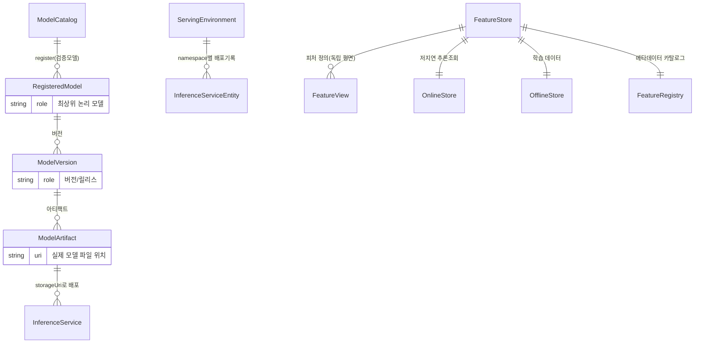

# 모델 거버넌스 — 영역 관계

> **두 개의 독립 거버넌스 평면**: 모델 메타데이터(Catalog+Registry) / 피처 메타데이터(Feast). CRD/operator 레벨에서 결합되지 않는다.
> 컴포넌트: [51-Model-Registry](51-Model-Registry.md) · [52-Model-Catalog](52-Model-Catalog.md) · [53-Feature-Store-Feast](53-Feature-Store-Feast.md)

---

## 핵심 결론: 3개 컴포넌트 = 2개 평면

| 평면 | 컴포넌트 | DSC 키 |
|---|---|---|
| **모델 메타데이터** | Model Catalog + Model Registry (동일 model-registry 컴포넌트) | `modelregistry` |
| **피처 메타데이터** | Feature Store (Feast) — 독립 | `feastoperator` |

> ⚠️ 이름 함정: Feast의 `registry`는 **feature registry**(feature view 카탈로그)로 Model Registry와 **이름만 같고 다른 개념**.
> ⚠️ Model Catalog는 **별도 DSC 컴포넌트가 아님** — model-registry 컴포넌트의 일부. 둘 다 `rhoai-model-registries` 네임스페이스.

---

## Catalog vs Registry

| | **Model Catalog** | **Model Registry** |
|---|---|---|
| 목적 | **발견·평가** (deploy 전) | **거버넌스·생명주기** (register/version) |
| 내용 | 검증/큐레이트 모델 목록 | 내가 등록·추적하는 모델 버전 |
| 흐름 | catalog(발견) → | → registry(거버넌스) → deploy(서빙) |

---

## CRD 엔티티 ERD (Mermaid)

> 모델 메타데이터 평면(Catalog+Registry)과 피처 평면(Feast)은 **연결선 없는 독립 평면**임에 주목.



### 오가는 데이터

| 관계 | 주고받는 데이터/신호 |
|---|---|
| ModelCatalog → RegisteredModel | 검증모델 메타데이터(OCI ModelCar) |
| ModelArtifact → InferenceService | `uri` → `storageUri`(직접 또는 `model-registry://` CSI) |
| ServingEnvironment → InferenceServiceEntity | 배포상태(DEPLOYED/UNDEPLOYED) 추적 |
| FeatureStore → Online/Offline | materialize(온라인 적재) / 학습 조회 |
| FeatureStore → Workbench | `feature_store.yaml` 마운트 |

## 모델 거버넌스 end-to-end
```
[Model Catalog]  발견·평가 (validated 모델, OCI ModelCar)
       │  register
       ▼
[Model Registry]  RegisteredModel → ModelVersion → ModelArtifact{uri}
       │  AI hub "Deploy" → Project(=ServingEnvironment) 선택
       ▼
  ModelArtifact.uri ──→ InferenceService.spec.predictor.model.storageUri
       │              (직접 기록  또는  model-registry:// CSI resolve)
       ▼
[KServe InferenceService] ──참조──> ServingRuntime/ClusterServingRuntime
       │
       ▼  Model Registry 컨트롤러가 라벨된 KServe IS를 watch
          → 레지스트리 InferenceService 엔티티 생성 + DesiredState 추적
```

## 피처 거버넌스 흐름 (병렬 평면)
```
[FeatureStore CR] (feastProject)
   └─ feast-operator → 단일 Deployment(online/offline/registry/ui 컨테이너) + client ConfigMap
        ├─ feature registry: feature view/entity 메타데이터
        ├─ offline store: 학습 데이터 → get_historical_features()
        └─ online store: materialize → get_online_features()
   └─ Workbench가 feature_store.yaml 마운트 → Feast SDK 소비
```

## 전체 그림
- Catalog+Registry = **모델 메타데이터 평면**, KServe가 그 배포 종착점.
- Feast = **피처 메타데이터 평면**(독립).
- 둘은 논리적으로만 인접(모델이 피처 소비). 직접 CRD 참조 없음.

## 출처
- 각 컴포넌트 노트 참조.
