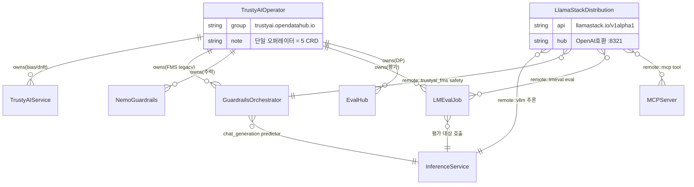

# GenAI / 평가 / 안전 — 영역 관계

> GenAI 앱을 **구축(Llama Stack) → 평가(LMEval) → 안전(TrustyAI) → 거버넌스/소비(AI Hub)** 하는 영역. GA/TP/DP가 심하게 혼재.
> 컴포넌트: [61-Llama-Stack](61-Llama-Stack.md) · [62-TrustyAI](62-TrustyAI.md) · [63-LMEval-Evaluation-Stack](63-LMEval-Evaluation-Stack.md) · [64-AI-Hub](64-AI-Hub.md)

---

## ★ 라이프사이클 혼재 (고객 전달 시 반드시 구분)

| 컴포넌트/기능 | 3.4 라이프사이클 |
|---|---|
| Llama Stack Operator/코어 | **GA** |
| Llama Stack 개별 API/프로바이더 | TP/DP 혼재 (responses·embeddings·vector_io=DP) |
| TrustyAIService (bias/drift/XAI) | GA급 (v1 storage) |
| **FMS Guardrails Orchestrator** | **legacy(deprecate 예정)** |
| **NeMo Guardrails** | 3.4 **주력** |
| LMEvalJob | 성숙(GA급) |
| Evaluation Stack control plane / EvalHub | **DP** / SDK·UI **TP** |
| Garak / RAGAS / GuideLLM | **TP** |
| AI Hub 골격 / Catalog·Registry·Deployments | GA |
| AI Available Assets | 프리뷰(TP/DP 미확정) |
| MCP Catalog | **DP** |

> 버전: RHOAI 3.4 GA = Llama Stack **0.6.0.1+rhai0**(upstream 0.6.0).

---

## CRD 엔티티 ERD (Mermaid)



### 오가는 데이터

| 관계 | 주고받는 데이터/신호 |
|---|---|
| TrustyAIOperator → 5 CRD | 단일 오퍼레이터가 reconcile |
| LlamaStack → InferenceService | OpenAI 추론 요청(`remote::vllm`) |
| LlamaStack → Guardrails | safety shield 호출(입출력 필터) |
| Guardrails → InferenceService | `chat_generation` predictor로 생성 위임 |
| LMEvalJob → InferenceService | 벤치마크 프롬프트 → results.json |

## CRD 소유권 맵 (ASCII)
```
llama-stack-k8s-operator
└── LlamaStackDistribution (llamastack.io/v1alpha1)

trustyai-service-operator   ← group: trustyai.opendatahub.io (★5개 CRD 단일 오퍼레이터)
├── TrustyAIService       (v1alpha1 + v1[storage])   bias/drift/XAI
├── GuardrailsOrchestrator(v1alpha1)                 FMS guardrails [legacy]
├── NemoGuardrails        (v1alpha1)                 NeMo guardrails [주력]
├── LMEvalJob             (v1alpha1)                 모델 평가
└── EvalHub               (v1alpha1 + v1[storage])   Evaluation Stack [DP]

mcp-lifecycle-operator (그룹 미확정: mcp.x-k8s.io vs toolhive.stacklok.dev)
├── MCPServer / MCPRegistry

[CRD 없음 / dashboard 레이어] AI Hub UI, AI Available Assets, MCP Catalog UI
```

---

## 런타임 데이터 흐름
```
사용자/에이전트 ──→ Llama Stack 서버 (OpenAI 호환 /v1/*, :8321) = 허브
   │ inference        │ safety            │ tool_runtime      │ eval
   ▼ remote::vllm     ▼ remote::trustyai  ▼ remote::mcp       ▼ remote::lmeval
 KServe vLLM      Guardrails Orch.     mcp-gateway        LMEvalJob
 (InferSvc)       (FMS/NeMo, 모델 앞단)  (MCP 서버 집계)     (lm-eval-harness Pod)
   │                  │ 입출력 detector                         │ results.json
   ▼                  ▼                                        ▼
 TrustyAIService (KServe payload 수집 → bias/drift/XAI → Prometheus)   EvalHub/MLflow

[거버넌스/발견 — AI Hub dashboard]
 Model Catalog → Model Registry → Deployments(KServe) ─┐
 MCP Catalog → mcp-lifecycle-operator → mcp-gateway ───┼─→ AI Available Assets
 LMEval/EvalHub 결과 ──────────────────────────────────┘   (프로젝트별 모델+MCP+MaaS 소비)
```

## 4컴포넌트 관계 요약
1. **구축**: AI Hub Catalog에서 모델 발견 → KServe/vLLM 배포 → **Llama Stack**이 inference provider로 묶고 MCP 도구를 tool_runtime으로 연결해 RAG/agentic 앱.
2. **평가**: **LMEval**이 KServe/vLLM 또는 Llama Stack(`remote::lmeval`)을 벤치마크. Garak/RAGAS/GuideLLM은 EvalHub control plane, 결과는 MLflow.
3. **안전**: **TrustyAI** Guardrails(FMS legacy/NeMo 주력)가 모델 앞단 프록시로 입출력 필터링. Llama Stack은 `remote::trustyai_fms`로 호출.
4. **거버넌스/소비**: **AI Hub**가 발견·등록·배포·가용자산을 dashboard로 통합.

핵심: **모든 평가/안전 CRD가 동일 `trustyai-service-operator` 소유**, **Llama Stack이 inference/safety/eval/tool을 각 KServe/TrustyAI/LMEval/MCP로 라우팅하는 허브**, **AI Hub는 CRD 없는 dashboard 레이어**(MCP 배포만 별도 operator).

## 출처
- 각 컴포넌트 노트 참조.
