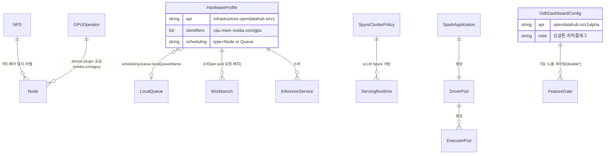

# 가속기 / 데이터 처리 / UI — 영역 관계

> 리소스 **공급(NFD/GPU·Spyre Operator) → 소비·배치(HardwareProfile) → 집계 쿼터(Kueue)** 의 3층 분업과, 모든 것의 진입점 ODH Dashboard.
> 컴포넌트: [71-GPU-하드웨어프로필](71-GPU-하드웨어프로필.md) · [72-IBM-Spyre](72-IBM-Spyre.md) · [73-Spark-Operator](73-Spark-Operator.md) · [74-ODH-Dashboard](74-ODH-Dashboard.md)

---

## CRD 엔티티 ERD (Mermaid)



### 오가는 데이터

| 관계 | 주고받는 데이터/신호 |
|---|---|
| NFD/GPUOperator → Node | 확장 리소스 공급(`nvidia.com/gpu`, MIG/time-slice) |
| HardwareProfile → 워크로드 | identifiers(요청량) + scheduling(배치) |
| HardwareProfile → LocalQueue | `localQueueName`(Queue 모드 시 Kueue 위임) |
| SpyreClusterPolicy → ServingRuntime | Spyre 가속기 서빙 경로 |
| SparkApplication → Driver/Executor | spark-submit 대행 → 파드 생성 |
| OdhDashboardConfig → 기능 | `disable*` 플래그 + DSC 설치 AND로 노출 |

## 관계 ERD (ASCII)
```
                    ┌─────────────────────────────┐
                    │   ODH Dashboard (Web UI)      │
                    │   OdhDashboardConfig          │
                    │   (opendatahub.io/v1alpha,    │
                    │    singleton, feature flags)  │
                    └──────────────┬──────────────┘
         읽기/생성 ┌───────────────┼───────────────────┐
                   ▼               ▼                   ▼
       ┌──────────────────┐ ┌────────────────┐ ┌──────────────────┐
       │ HardwareProfile  │ │ KServe         │ │ SparkApplication │
       │ infrastructure.  │ │ InferenceSvc/  │ │ sparkoperator.   │
       │ opendatahub.io/v1│ │ ServingRuntime │ │ k8s.io/v1beta2   │
       └───────┬──────────┘ └───────┬────────┘ └───────┬──────────┘
    type=Queue │             ┌──────┴──────┐           ▼
               ▼             │ vLLM Spyre  │     driver Pod
       ┌──────────────┐      │ ServingRuntime│  └─► executor Pods
       │ Kueue        │      │ (x86/Z/Power)│
       │ LocalQueue/  │      └──────┬───────┘
       │ ClusterQueue/│             │ SpyreClusterPolicy
       │ ResourceFlavor│            ▼
       └──────────────┘     ┌──────────────────┐
                            │ IBM Spyre Operator│
 (공통 전제) NFD ─► GPU/Spyre Operator ─► device plugin
            (탐지)   (MIG/time-slicing, 리소스 공급)
```

---

## 데이터 흐름 (★3층 분업)
1. **공급층**: NFD가 노드 탐지·라벨링 → GPU Operator/Spyre Operator가 device plugin으로 `nvidia.com/gpu`·`ibm.com/spyre_pf` 등 확장 리소스 공급(MIG/time-slicing 분할도 여기).
2. **추상화층**: HardwareProfile이 그 리소스명을 identifiers로 참조, per-pod 요청량·배치 정의. type=Node면 직접 placement, type=Queue면 Kueue 위임.
3. **워크로드층**: 워크벤치/파이프라인/서빙/Spark가 HardwareProfile 소비.
4. **제어/진입층**: ODH Dashboard가 모든 CRD를 생성·조회, OdhDashboardConfig 피처 플래그 + DSC 컴포넌트 설치(AND)로 기능 노출 게이팅.

---

## 핵심 경계 요약
- **NFD/GPU·Spyre Operator = 리소스 공급자**, **HardwareProfile = per-pod 소비·배치**, **Kueue = 집계 쿼터·admission** — 3층 모두 별개.
- **Dashboard = 오케스트레이터/뷰어**(CRD를 직접 만들지만 백엔드 설치는 DSC가 결정 → UI 가시성 vs 설치 2층 구조).
- Spark Operator만 아직 **DP**라 Dashboard 통합 없이 CR 기반 사용.

> HardwareProfile vs Kueue 구분은 [71-GPU-하드웨어프로필](71-GPU-하드웨어프로필.md)·[21-Kueue](21-Kueue.md) 참조. (per-pod 요청 vs 집계 쿼터)

## 출처
- 각 컴포넌트 노트 참조.
